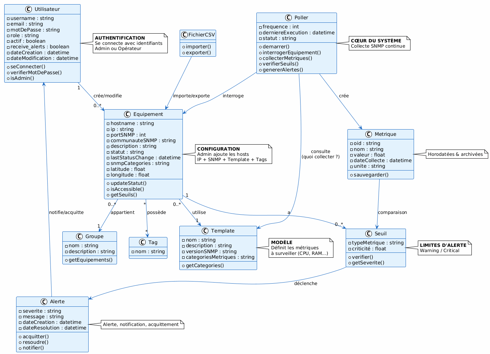
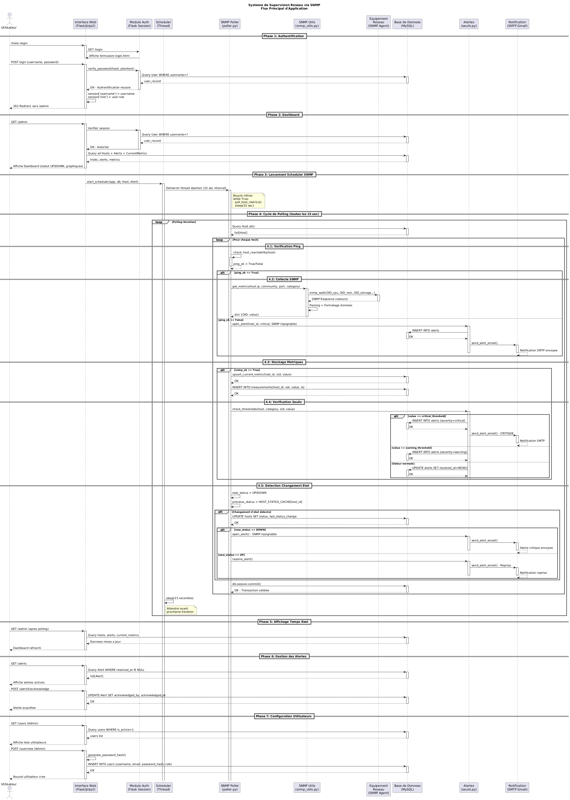
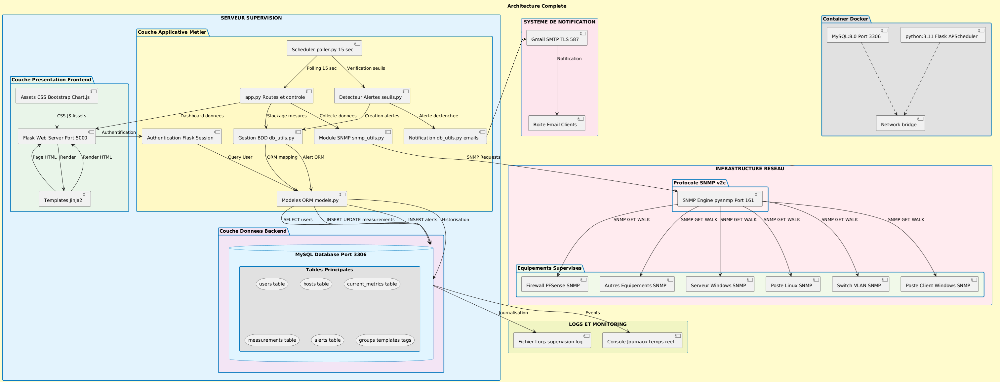

# Système de Supervision Réseau SNMP

Ce dossier contient l'ensemble des diagrammes UML et schémas d'architecture du système de supervision réseau basé sur le protocole SNMP. Ces diagrammes permettent de comprendre le fonctionnement global de l'application, son architecture et ses interactions.

## Fonctionnement de l'application

### Principe général

L'application est un **système de supervision réseau** qui permet de :

1. **Surveiller en temps réel** un parc d'équipements réseau (serveurs, routeurs, switches, etc.)
2. **Collecter des métriques** via le protocole SNMP (CPU, RAM, stockage, interfaces réseau)
3. **Analyser les données** et comparer avec des seuils configurables
4. **Générer des alertes** en cas de dépassement de seuils ou d'équipement inaccessible
5. **Notifier les utilisateurs** par email et interface web
6. **Historiser les mesures** dans une base de données MySQL
7. **Visualiser** l'état du parc avec graphiques et tableaux de bord

### Architecture technique

L'application est construite autour de 5 modules principaux :

#### **Module Web (Flask)**
- Interface utilisateur responsive (HTML/CSS/Bootstrap)
- Authentification et gestion des rôles (admin/opérateur)
- Dashboard temps réel avec graphiques (Chart.js)
- CRUD des équipements, groupes, templates
- Gestion des alertes et acquittement

#### **Module Base de données (MySQL + SQLAlchemy)**
- Stockage des équipements et configurations
- Tables de métriques actuelles (`current_metrics`)
- Historique des mesures (`measurements`)
- Journal des alertes (`alerts`)
- Gestion utilisateurs, groupes, tags, templates

#### **Module Poller SNMP**
- Collecte automatique toutes les 15 secondes
- Interrogation SNMP v2c des équipements
- Détection d'accessibilité (ping/SNMP)
- Mise à jour statut (UP/DOWN/WARNING)
- Thread daemon asynchrone

#### **Module Alertes**
- Comparaison des valeurs avec seuils configurables
- Calcul de sévérité (info/warning/critical)
- Détection de changements d'état
- Détection de changements d'interfaces réseau
- Notification email via SMTP

#### **Module Visualisation**
- Graphiques temps réel et historiques
- Export CSV des alertes
- Vue détaillée par équipement
- Carte de localisation (latitude/longitude)
- Logs de supervision consultables

## Diagrammes disponibles

### 1. Diagramme de cas d'usage

**Description :**  
Présente les différents acteurs (Administrateur, Opérateur) et leurs interactions avec le système :
- Authentification
- Gestion des équipements
- Consultation des métriques
- Gestion des alertes
- Configuration des seuils
- Administration utilisateurs

---

### 2. Diagramme de classes

**Description :**  
Modèle de données complet avec les classes principales :
- **Utilisateur** : authentification et rôles
- **Equipement** : hosts supervisés avec configuration SNMP
- **Template** : modèles de supervision
- **Groupe** : regroupement logique d'équipements
- **Tag** : étiquetage flexible
- **Seuil** : limites d'alerte
- **Metrique** : mesures collectées
- **Alerte** : événements générés
- **Poller** : moteur de collecte SNMP
- **FichierCSV** : import/export

---

### 3. Diagramme de séquence

**Description :**  
Flux détaillé des interactions du système :

1. **Authentification** : vérification utilisateur
2. **Dashboard** : affichage temps réel
3. **Scheduler** : démarrage thread poller
4. **Cycle polling** :
   - Récupération liste hosts
   - Vérification accessibilité
   - Collecte SNMP (system, cpu, ram, storage)
   - Stockage métriques
   - Vérification seuils
   - Génération alertes
5. **Notifications** : envoi emails
6. **Gestion équipements** : CRUD hosts
7. **Gestion alertes** : acquittement

---

### 4. Diagramme d'architecture système

**Description :**  
Vue d'ensemble de l'infrastructure complète :

**Couche Présentation :**
- Flask Web Server (port 5000)
- Templates Jinja2
- Assets statiques (CSS/JS)

**Couche Application :**
- `app.py` : routes Flask
- `snmp_utils.py` : collecte SNMP
- `poller.py` : scheduler
- `seuils.py` : détection alertes
- `db_utils.py` : notifications
- `models.py` : ORM SQLAlchemy

**Couche Données :**
- MySQL (port 3306)
- Tables : users, hosts, alerts, current_metrics, measurements

**Infrastructure Réseau :**
- Équipements SNMP v2c (port 161 UDP)
- SMTP Gmail (notifications)
- Logs rotatifs

---

## Technologies utilisées

| Composant | Technologie |
|-----------|-------------|
| **Backend** | Python 3.x + Flask |
| **Base de données** | MySQL 8.0 + SQLAlchemy ORM |
| **SNMP** | pysnmp (v2c) |
| **Frontend** | HTML5 / CSS3 / Bootstrap 5 |
| **Graphiques** | Chart.js + Plotly |
| **Scheduling** | Thread Python (daemon) |
| **Notifications** | SMTP (Gmail) |
| **Déploiement** | Docker + docker-compose |

