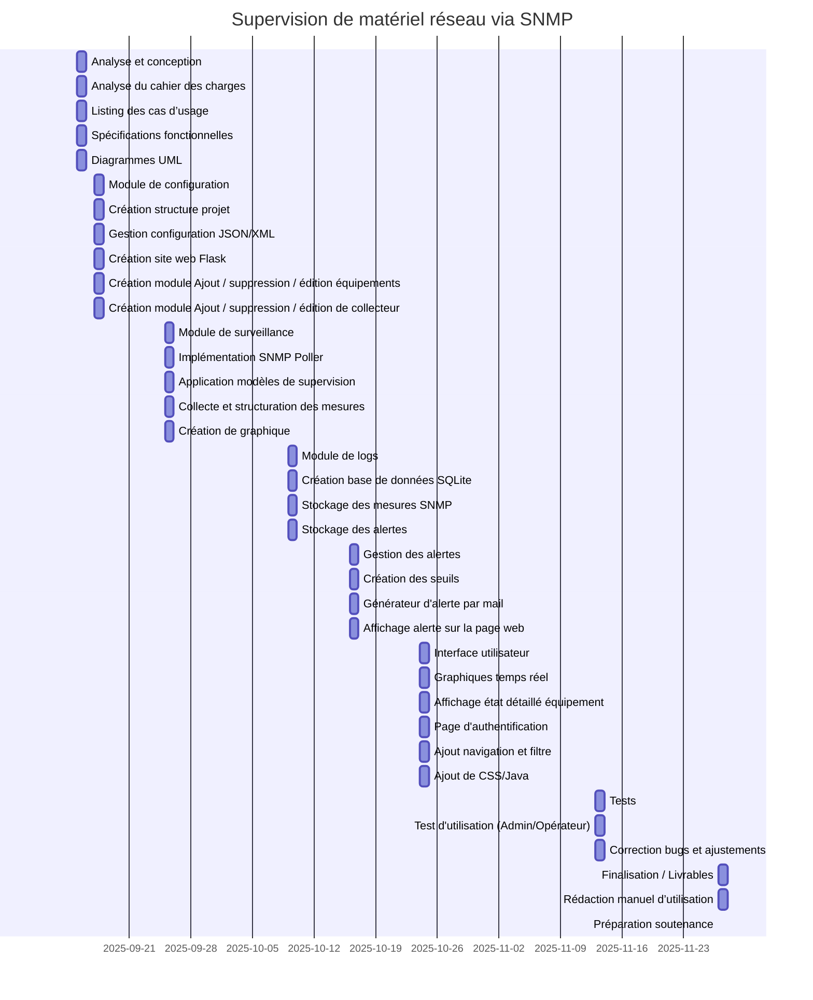

# Projet de supervision réseau via SNMP

## Contexte
Ce projet a été réalisé dans le cadre d’un module de 32 heures.  
L’objectif est de développer une application de **supervision réseau** permettant de surveiller un parc de matériels hétérogènes (serveurs, routeurs, switchs, etc.) à l’aide du protocole **SNMP**.

---

## Objectifs
L’application doit permettre :
- La **surveillance en ligne** du parc avec affichage textuel et graphique.
- La **sauvegarde des mesures** dans une base de données.
- La **gestion des alertes** grâce à des seuils configurables.
- La **gestion des défaillances** avec enregistrement dans des logs.
- La possibilité de définir des **modèles de supervision** adaptés à chaque type d’équipement (serveur web, serveur de fichiers, routeur, switch...).

---

## Architecture
L’application est découpée en plusieurs modules :

1. **Module Configuration (Flask UI)**  
   - Ajouter, éditer, supprimer des équipements.  
   - Import/export configuration JSON ou XML.  
   - Gestion des modèles de supervision (templates OID).  

2. **Module Base de données (SQLite/SQLAlchemy)**  
   - Stockage des équipements, métriques, mesures et alertes.  
   - Schéma simple, extensible pour différents types d’équipements.  

3. **Module Poller SNMP**  
   - Collecte périodique des données via SNMP (pysnmp).  
   - Gestion des timeouts et retries.  
   - Détection des équipements inaccessibles.  

4. **Module Alerte / Notification**  
   - Comparaison des mesures avec les seuils.  
   - Génération d’alertes (warning/critical).  
   - Historisation des événements.  

5. **Module Visualisation / Graphiques**  
   - Affichage en temps réel et historique des mesures.  
   - Graphiques interactifs (Chart.js / Plotly).  
   - Export CSV/JSON.  

---

## Technologies utilisées
- **Langage principal :** Python 3.x  
- **Framework web :** Flask (backend + Jinja2)  
- **Base de données :** SQLite (MVP) / PostgreSQL (optionnel)  
- **ORM :** SQLAlchemy  
- **SNMP :** pysnmp  
- **Planification :** schedule / APScheduler  
- **Graphiques :** Matplotlib, Plotly ou Chart.js  
- **Frontend :** HTML5 / CSS3 / Bootstrap  

---

## Organisation du projet

