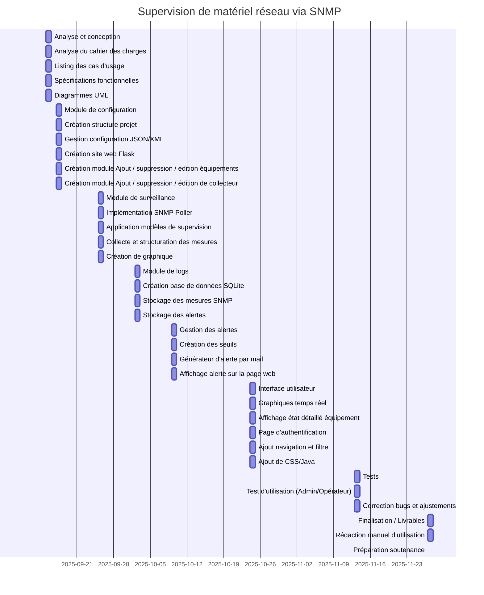

```mermaid
gantt
    dateFormat  YYYY-MM-DD
    title Supervision de matériel réseau via SNMP
    Analyse et conception : 0, 2025-09-15, 1d
    Analyse du cahier des charges : 9, 2025-09-15, 1d
    Listing des cas d’usage : 12, 2025-09-15, 1d
    Spécifications fonctionnelles : 11, 2025-09-15, 1d
    Diagrammes UML : 10, 2025-09-15, 1d
    Module de configuration : 1, 2025-09-17, 1d
    Création structure projet : 13, 2025-09-17, 1d
    Gestion configuration JSON/XML : 14, 2025-09-17, 1d
    Création site web Flask : 15, 2025-09-17, 1d
    Création module Ajout / suppression / édition équipements : 17, 2025-09-17, 1d
    Création module Ajout / suppression / édition de collecteur : 18, 2025-09-17, 1d
    Module de surveillance : 2, 2025-09-25, 1d
    Implémentation SNMP Poller : 20, 2025-09-25, 1d
    Application modèles de supervision : 19, 2025-09-25, 1d
    Collecte et structuration des mesures : 21, 2025-09-25, 1d
    Création de graphique : 22, 2025-09-25, 1d
    Module de logs : 3, 2025-10-02, 1d
    Création base de données SQLite : 23, 2025-10-02, 1d
    Stockage des mesures SNMP : 24, 2025-10-02, 1d
    Stockage des alertes : 26, 2025-10-02, 1d
    Gestion des alertes : 4, 2025-10-09, 1d
    Création des seuils : 25, 2025-10-09, 1d
    Générateur d'alerte par mail : 27, 2025-10-09, 1d
    Affichage alerte sur la page web : 28, 2025-10-09, 1d
    Interface utilisateur : 5, 2025-10-24, 1d
    Graphiques temps réel : 33, 2025-10-24, 1d
    Affichage état détaillé équipement : 32, 2025-10-24, 1d
    Page d'authentification : 30, 2025-10-24, 1d
    Ajout navigation et filtre : 29, 2025-10-24, 1d
    Ajout de CSS/Java : 31, 2025-10-24, 1d
    Tests : 6, 2025-11-13, 1d
    Test d'utilisation (Admin/Opérateur) : 37, 2025-11-13, 1d
    Correction bugs et ajustements : 34, 2025-11-13, 1d
    Finalisation / Livrables : 8, 2025-11-27, 1d
    Rédaction manuel d’utilisation : 35, 2025-11-27, 1d
    Préparation soutenance : 36, 2025-11-27, 0d
```
